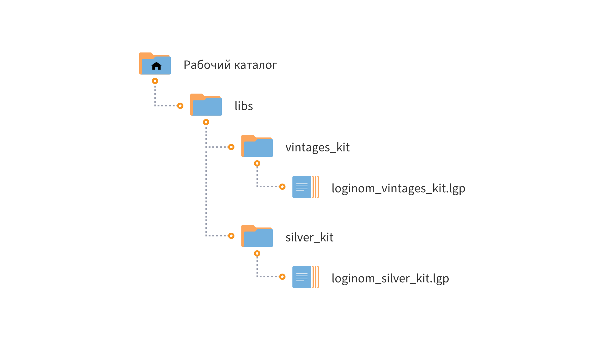

# Loginom Vintages Kit CE

* Версия: 3.0.0
* Проверено: Loginom CE 7.0.2

Компоненты библиотеки **Loginom Vintages Kit CE** предназначены для решения задачи проведения винтажного анализа и выбора окна наблюдения в кредитном скоринге.

В библиотеке реализована возможность исследования данных по просрочкам:

* нормализация набора данных;
* проведение аудита просрочек;
* проверка на наличие ошибок;
* отбор счетов для анализа;
* проведение винтажного анализа;
* построение матрицы миграции.

Дополнительно реализована возможность проведения винтажного анализа займов PDL.

Компоненты находятся в пакете **loginom_vintages_kit.lgp**.

# Установка и настройка

## Требования

Для работы  библиотеки **Loginom Vintages Kit CE** необходимо:

* Loginom Community Edition. Коммерческие версии Loginom не поддерживаются;

* Библиотека **Loginom Silver Kit** ([скачать на GitHub](https://github.com/loginom/loginom-silver-kit)). Версия не ниже 3.0.0.

## Порядок установки

1. Определите рабочий каталог, где будут расположены ваши библиотеки на локальном диске.
2. Создайте в нем подкаталог **libs**.
3. Разместите папку **vintages_kit** в каталоге **libs**.
4. Убедитесь, что библиотека **Loginom Silver Kit** находится в каталоге **libs** в папке **silver_kit**.

